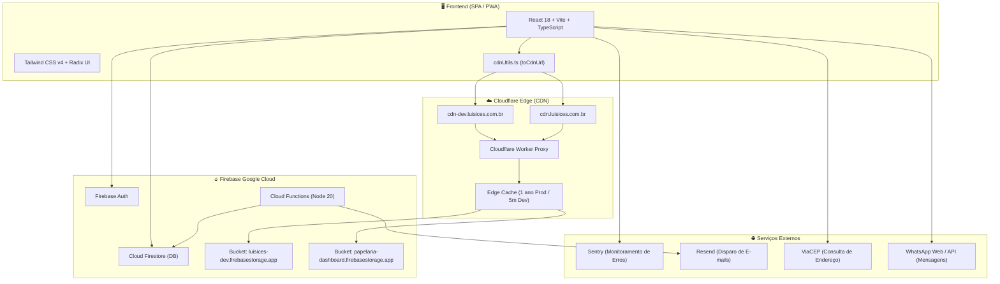

# 📚 Documentação de Dependências e Arquitetura do Projeto

Este documento detalha **todas as dependências**, serviços externos, arquitetura de infraestrutura e a integração da **Cloudflare CDN** com o **Firebase Storage**.

---

## 🏗️ 1. Visão Geral da Arquitetura



---

## 📦 2. Catálogo Completo de Dependências

### 🖥️ Frontend (Root `package.json`)

#### Core & Framework
| Dependência | Versão | Finalidade |
| :--- | :--- | :--- |
| `react` | `18.3.1` | Biblioteca principal de interface do usuário |
| `react-dom` | `18.3.1` | Renderização do React para a Web |
| `react-router` | `^7.18.2` | Roteamento SPA e gerenciamento de rotas |
| `typescript` | `^5.7.3` | Tipagem estática e segurança de código |
| `vite` | `^6.4.3` | Build tool e servidor de desenvolvimento ultra-rápido |

#### Interface & Design System (Radix UI + Tailwind)
| Dependência | Versão | Finalidade |
| :--- | :--- | :--- |
| `tailwindcss` | `4.1.12` | Framework CSS utilitário (versão moderna v4) |
| `@tailwindcss/vite` | `4.1.12` | Plugin oficial do Tailwind v4 para o Vite |
| `@radix-ui/react-*` | `~1.1 / ~1.2` | Primitivos de componentes acessíveis (Dialog, Dropdown, Tabs, Tooltip, Select, Switch, Popover, Slider, etc.) |
| `lucide-react` | `0.487.0` | Biblioteca de ícones SVG consistentes |
| `class-variance-authority` | `0.7.1` | Criação de variantes de componentes (CVA) |
| `clsx` | `2.1.1` | Concatenação condicional de classes CSS |
| `tailwind-merge` | `3.2.0` | Resolução inteligente de conflitos de classes Tailwind |
| `tw-animate-css` | `1.3.8` | Animações CSS prontas para Tailwind |
| `next-themes` | `0.4.6` | Gerenciamento de tema Claro / Escuro / Sistema |
| `sonner` | `2.0.3` | Sistema de notificações Toast elegante |
| `vaul` | `1.1.2` | Drawer modal estilo mobile interativo |
| `cmdk` | `1.1.1` | Menu de comando rápido (Command Palette) |
| `input-otp` | `1.4.2` | Componente de input para códigos OTP / PIN |

#### Formulários & Validação
| Dependência | Versão | Finalidade |
| :--- | :--- | :--- |
| `react-hook-form` | `7.55.0` | Gerenciamento de estado de formulários de alta performance |
| `zod` | `^4.3.6` | Validação de esquemas e contratos de dados |
| `@hookform/resolvers` | `^3.10.0` | Integração de esquemas Zod com React Hook Form |

#### Gráficos, Exportação & Manipulação de Arquivos
| Dependência | Versão | Finalidade |
| :--- | :--- | :--- |
| `recharts` | `2.15.2` | Gráficos e dashboards analíticos interativos |
| `jspdf` | `^4.2.1` | Geração de PDFs client-side para pedidos e orçamentos |
| `jspdf-autotable` | `^5.0.7` | Criação de tabelas formatadas em relatórios PDF |
| `xlsx` | `^0.18.5` | Exportação de planilhas Excel dos relatórios financeiros |
| `date-fns` | `3.6.0` | Manipulação e formatação de datas |

#### Animação, Drag & Drop e Carrossel
| Dependência | Versão | Finalidade |
| :--- | :--- | :--- |
| `motion` | `12.23.24` | Animações fluidas de interface (Framer Motion) |
| `react-dnd` | `16.0.1` | Drag and drop para kanban e reordenação |
| `react-dnd-html5-backend`| `16.0.1` | Backend HTML5 para react-dnd |
| `embla-carousel-react` | `8.6.0` | Carrossel touch responsivo para banners da loja |
| `react-responsive-masonry`| `2.7.1` | Grid estilo Pinterest para galeria de artes |
| `react-resizable-panels`| `2.1.7` | Painéis redimensionáveis na interface |

#### Backend Client & Observabilidade
| Dependência | Versão | Finalidade |
| :--- | :--- | :--- |
| `firebase` | `^12.9.0` | SDK Client (Auth, Firestore, Storage, Analytics, Performance) |
| `@sentry/react` | `^8.55.0` | Monitoramento e rastreamento de exceções em tempo real |
| `workbox-window` | `^7.4.0` | Suporte a Service Worker e recursos PWA offline |

#### Dev & Build Tools
| Dependência | Versão | Finalidade |
| :--- | :--- | :--- |
| `@playwright/test` | `^1.49.1` | Testes E2E, fluxos críticos, segurança e permissões |
| `@vitejs/plugin-react` | `4.7.0` | Suporte a Fast Refresh no React via Vite |
| `vite-plugin-pwa` | `^1.3.0` | Geração de manifest e Service Worker PWA |
| `vite-plugin-html` | `^3.2.2` | Minificação e injeção de tags no HTML |
| `sharp` | `^0.34.5` | Otimização de imagens em scripts de build |
| `dotenv` | `^17.3.1` | Carregamento de variáveis de ambiente em scripts Node |
| `firebase-admin` | `^13.7.0` | SDK Admin usado em scripts utilitários de manutenção |

---

### ⚙️ Backend Cloud Functions (`functions/package.json`)

| Dependência | Versão | Finalidade |
| :--- | :--- | :--- |
| `firebase-admin` | `^12.0.0` | Acesso privilegiado ao Firestore e Auth no backend |
| `firebase-functions` | `^4.5.0` | Triggers e endpoints HTTP / callable functions |
| `resend` | `^6.9.3` | Envio transacional de e-mails de notificações |
| `rate-limiter-flexible` | `^9.1.1` | Proteção contra abuso e limitação de taxa (Rate Limit) |

---

## ☁️ 3. Arquitetura de CDN de Imagens (Cloudflare Worker)

Para garantir **branding com domínio próprio**, **alta velocidade (Edge Caching)** e **segurança**, as imagens do Firebase Storage são servidas via Cloudflare Worker.

### 🌐 Domínios e Subdomínios

| Ambiente | Domínio da CDN | Bucket de Origem (Firebase) |
| :--- | :--- | :--- |
| **Produção** | `https://cdn.luisices.com.br` | `papelaria-dashboard.firebasestorage.app` |
| **Desenvolvimento** | `https://cdn-dev.luisices.com.br` | `luisices-dev.firebasestorage.app` |

### 🛠️ Código do Cloudflare Worker

```javascript
/**
 * Cloudflare Worker: Multi-Environment CDN para Firebase Storage
 */
const BUCKETS = {
  prod: "papelaria-dashboard.firebasestorage.app",
  dev: "luisices-dev.firebasestorage.app",
};

export default {
  async fetch(request, env, ctx) {
    const url = new URL(request.url);

    // 1. Suporte a CORS Preflight
    if (request.method === "OPTIONS") {
      return new Response(null, {
        headers: {
          "Access-Control-Allow-Origin": "*",
          "Access-Control-Allow-Methods": "GET, HEAD, OPTIONS",
          "Access-Control-Allow-Headers": "*",
        },
      });
    }

    // 2. Identificação do ambiente
    const isDev = url.hostname.includes("dev");
    const targetBucket = env.FIREBASE_BUCKET || (isDev ? BUCKETS.dev : BUCKETS.prod);

    if (url.pathname === "/" || url.pathname === "") {
      return new Response(
        `CDN Storage Online [Ambiente: ${isDev ? "DEV" : "PROD"}]`,
        { status: 200 }
      );
    }

    // 3. Extrair e codificar o caminho do arquivo
    const rawPath = url.pathname.replace(/^\/+/, "");
    const encodedPath = encodeURIComponent(rawPath);

    // 4. Força alt=media para retornar bytes da imagem e repassa token
    const searchParams = new URLSearchParams(url.search);
    searchParams.set("alt", "media");

    const targetUrl = `https://firebasestorage.googleapis.com/v0/b/${targetBucket}/o/${encodedPath}?${searchParams.toString()}`;

    // 5. Busca a imagem no Firebase Storage
    const originResponse = await fetch(targetUrl, {
      method: "GET",
      headers: {
        "Accept": "*/*",
        "User-Agent": "Cloudflare-Storage-CDN",
      },
    });

    if (!originResponse.ok) {
      return new Response(originResponse.body, {
        status: originResponse.status,
        statusText: originResponse.statusText,
        headers: {
          "Access-Control-Allow-Origin": "*",
          "Content-Type": originResponse.headers.get("Content-Type") || "text/plain",
        },
      });
    }

    // 6. Retorna a imagem com CORS e Cache da Cloudflare
    const headers = new Headers(originResponse.headers);
    headers.set("Access-Control-Allow-Origin", "*");
    headers.set(
      "Cache-Control",
      isDev ? "public, max-age=300" : "public, max-age=31536000, immutable"
    );
    headers.delete("set-cookie");

    return new Response(originResponse.body, {
      status: 200,
      headers,
    });
  },
};
```

---

## 🔒 4. Variáveis de Ambiente e Segredos (CI/CD)

### 💻 Ambiente Local (`.env.local`)
```env
# Aponta para a CDN de Desenvolvimento
VITE_STORAGE_CDN_URL=https://cdn-dev.luisices.com.br
```

### 🔐 GitHub Actions Secrets (`Settings > Secrets and variables > Actions`)

| Secret | Finalidade | Ambiente |
| :--- | :--- | :--- |
| `VITE_STORAGE_CDN_URL` | `https://cdn.luisices.com.br` | Produção (`main`) |
| `DEV_VITE_STORAGE_CDN_URL` | `https://cdn-dev.luisices.com.br` | Desenvolvimento (`develop`) |
| `VITE_FIREBASE_*` | Credenciais do Firebase de Produção | Produção |
| `DEV_VITE_FIREBASE_*` | Credenciais do Firebase de Desenvolvimento | Desenvolvimento |
| `FIREBASE_SERVICE_ACCOUNT_DEV` | Service Account JSON para deploy no Firebase Hosting | Desenvolvimento |

---

## 🧩 5. Utilitários no Código

* **[`src/app/utils/cdnUtils.ts`](file:///home/ubuntu/luisices/src/app/utils/cdnUtils.ts):** Função `toCdnUrl(url)` que intercepta links do Firebase Storage e converte para a CDN configurada sem exigir migração no banco de dados.
* **[`src/services/firebaseStorageService.ts`](file:///home/ubuntu/luisices/src/services/firebaseStorageService.ts):** Otimiza imagens para WebP client-side e grava URLs limpas da CDN no Firestore.
* **[`src/contexts/UserSettingsContext.tsx`](file:///home/ubuntu/luisices/src/contexts/UserSettingsContext.tsx):** Aplica URLs da CDN para logos, avatares e banners.
* **[`src/app/pages/PublicCatalog.tsx`](file:///home/ubuntu/luisices/src/app/pages/PublicCatalog.tsx):** Garante que o catálogo público sirva fotos e banners direto pela CDN.
