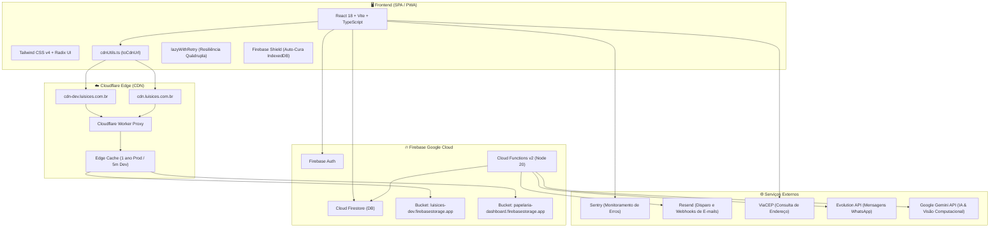

# 📚 Documentação de Dependências e Arquitetura do Projeto

Este documento detalha **todas as dependências**, serviços externos, arquitetura de infraestrutura, coleções do Firestore e a integração da **Cloudflare CDN** com o **Firebase Storage**.

---

## 🏗️ 1. Visão Geral da Arquitetura

---

## 📦 2. Catálogo Completo de Dependências

### 🖥️ Frontend (Root `package.json`)

#### Core & Framework
| Dependência | Versão | Finalidade |
| :--- | :--- | :--- |
| `react` | `18.3.1` | Biblioteca principal de interface do usuário |
| `react-dom` | `18.3.1` | Renderização do React para a Web |
| `react-router` | `^7.18.2` | Roteamento SPA e gerenciamento de rotas |
| `typescript` | `^5.7.3` | Tipagem estática e segurança de código |
| `vite` | `^6.4.3` | Build tool e servidor de desenvolvimento ultra-rápido |

#### Interface & Design System (Radix UI + Tailwind)
| Dependência | Versão | Finalidade |
| :--- | :--- | :--- |
| `tailwindcss` | `4.1.12` | Framework CSS utilitário (versão moderna v4) |
| `@tailwindcss/vite` | `4.1.12` | Plugin oficial do Tailwind v4 para o Vite |
| `@radix-ui/react-*` | `~1.1 / ~1.2` | Primitivos de componentes acessíveis (Dialog, Dropdown, Tabs, Tooltip, Select, Switch, Popover, Slider, etc.) |
| `lucide-react` | `0.487.0` | Biblioteca de ícones SVG consistentes |
| `class-variance-authority` | `0.7.1` | Criação de variantes de componentes (CVA) |
| `clsx` | `2.1.1` | Concatenação condicional de classes CSS |
| `tailwind-merge` | `3.2.0` | Resolução inteligente de conflitos de classes Tailwind |
| `tw-animate-css` | `1.3.8` | Animações CSS prontas para Tailwind |
| `next-themes` | `0.4.6` | Gerenciamento de tema Claro / Escuro / Sistema |
| `sonner` | `2.0.3` | Sistema de notificações Toast elegante |
| `vaul` | `1.1.2` | Drawer modal estilo mobile interativo |
| `cmdk` | `1.1.1` | Menu de comando rápido (Command Palette) |
| `input-otp` | `1.4.2` | Componente de input para códigos OTP / PIN |

#### Formulários & Validação
| Dependência | Versão | Finalidade |
| :--- | :--- | :--- |
| `react-hook-form` | `7.55.0` | Gerenciamento de estado de formulários de alta performance |
| `zod` | `^4.3.6` | Validação de esquemas e contratos de dados |
| `@hookform/resolvers` | `^3.10.0` | Integração de esquemas Zod com React Hook Form |

#### Gráficos, Exportação & Manipulação de Arquivos
| Dependência | Versão | Finalidade |
| :--- | :--- | :--- |
| `recharts` | `2.15.2` | Gráficos e dashboards analíticos interativos |
| `jspdf` | `^4.2.1` | Geração de PDFs client-side (*Dynamic Import sob demanda*) |
| `jspdf-autotable` | `^5.0.7` | Criação de tabelas formatadas em relatórios PDF |
| `xlsx` | `^0.18.5` | Exportação de planilhas Excel (*Dynamic Import sob demanda*) |
| `date-fns` | `3.6.0` | Manipulação e formatação de datas |

#### Animação, Drag & Drop e Carrossel
| Dependência | Versão | Finalidade |
| :--- | :--- | :--- |
| `motion` | `12.23.24` | Animações fluidas de interface (Framer Motion) |
| `react-dnd` | `16.0.1` | Drag and drop para kanban e reordenação |
| `react-dnd-html5-backend`| `16.0.1` | Backend HTML5 para react-dnd |
| `embla-carousel-react` | `8.6.0` | Carrossel touch responsivo para banners da loja |
| `react-responsive-masonry`| `2.7.1` | Grid estilo Pinterest para galeria de artes |
| `react-resizable-panels`| `2.1.7` | Painéis redimensionáveis na interface |

#### Backend Client & Observabilidade
| Dependência | Versão | Finalidade |
| :--- | :--- | :--- |
| `firebase` | `^12.9.0` | SDK Client (Auth, Firestore com Persistent Cache, Storage, Analytics, Performance) |
| `@sentry/react` | `^8.55.0` | Monitoramento e rastreamento de exceções em tempo real |
| `workbox-window` | `^7.4.0` | Suporte a Service Worker e recursos PWA offline |

#### Dev & Build Tools
| Dependência | Versão | Finalidade |
| :--- | :--- | :--- |
| `@playwright/test` | `^1.49.1` | Testes E2E, fluxos críticos, segurança e permissões |
| `@vitejs/plugin-react` | `4.7.0` | Suporte a Fast Refresh no React via Vite |
| `vite-plugin-pwa` | `^1.3.0` | Geração de manifest e Service Worker PWA |
| `vite-plugin-html` | `^3.2.2` | Minificação e injeção de tags no HTML |
| `sharp` | `^0.34.5` | Otimização de imagens em scripts de build |
| `dotenv` | `^17.3.1` | Carregamento de variáveis de ambiente em scripts Node |
| `firebase-admin` | `^13.7.0` | SDK Admin usado em scripts utilitários de manutenção |

---

### ⚙️ Backend Cloud Functions (`functions/package.json`)

| Dependência | Versão | Finalidade |
| :--- | :--- | :--- |
| `firebase-admin` | `^12.0.0` | Acesso privilegiado ao Firestore e Auth no backend |
| `firebase-functions` | `^4.5.0` | Triggers e endpoints HTTP / callable functions v2 |
| `resend` | `^6.9.3` | Envio e recebimento de e-mails transacionais |
| `rate-limiter-flexible` | `^9.1.1` | Proteção contra abuso e limitação de taxa (Rate Limit) |

---

## 🗄️ 3. Mapeamento de Coleções do Cloud Firestore

| Coleção | Caminho | Finalidade | Regra de Acesso |
|---|---|---|---|
| **Pedidos do Ateliê** | `/orders/{orderId}` | Pedidos de produção internos | Isolado por `userId` + permissão de equipe (`assignedTo`) |
| **Clientes** | `/customers/{customerId}` | Base de clientes do ateliê | Isolado por `userId` |
| **Produtos Internos** | `/products/{productId}` | Catálogo de insumos e peças internas | Isolado por `userId` |
| **Orçamentos** | `/quotes/{quoteId}` | Propostas comerciais enviadas | Isolado por `userId` |
| **Galeria** | `/gallery/{imageId}` | Fotos de trabalhos realizados | Isolado por `userId` |
| **Trocas / Permutas** | `/exchanges/{exchangeId}` | Registros de permutas e parcerias | Isolado por `userId` |
| **Perfis de Usuários** | `/userProfiles/{uid}` | Papéis (`admin`, `funcionario`, `user`) e permissões | Leitura autenticada; escrita restrita a Admin |
| **Produtos da Lojinha** | `/storeProducts/{id}` | Vitrine de produtos do catálogo online | Leitura pública; escrita restrita a usuários com permissão |
| **Pedidos da Lojinha** | `/catalogOrders/{id}` | Pedidos recebidos via vitrine pública | Criação pública; gestão por usuários autorizados |
| **Configurações da Loja** | `/storeSettings/public` | Banners, WhatsApp de vendas e tema da lojinha | Leitura pública; edição exclusiva por Admin |
| **Configurações de Usuário** | `/users/{uid}/settings/profile` | Preferências de UI, tema e dados do ateliê | Acesso restrito ao próprio usuário |
| **Histórico de E-mails** | `/sentEmails/{id}` | Registro de e-mails disparados via Resend | Leitura restrita a Admin |
| **Convites** | `/invitations/{hashToken}` | Tokens SHA-256 de convite para cadastro | Validação e criação controlada |
| **Conversas WhatsApp** | `/whatsapp_chats/{phone}` | Metadados e snippets de conversas do WhatsApp | Acesso restrito a usuários com permissão `whatsapp` |
| **Mensagens WhatsApp** | `/whatsapp_messages/{id}` | Histórico completo de mensagens recebidas e enviadas | Acesso restrito a usuários com permissão `whatsapp` |
| **Logs de Consumo de IA** | `/ai_usage_logs/{id}` | Métricas e contagem de requisições por modelo da API Gemini | Exclusivo backend Admin SDK (inacessível via cliente) |
| *(Descontinuada)* **Visão de Pedidos para IA** | `/ai_orders_view/{orderId}` | *Legada/Descontinuada*: Substituída por projeção sanitizada em memória direta de `/orders` | Obsoleta (Zero manutenção manual) |

---

## 🛡️ 4. Resiliência de Aplicação e Auto-Cura

1. **Carregador de Rotas Quádruplo (`lazyWithRetry` em `routes.tsx`)**:
   - Suporte a named e default exports.
   - Retry de 800ms contra oscilações de rede.
   - Auto-recuperação com limpeza de caches e reload inteligente para prevenir erro de módulos dinâmicos desatualizados após deploys.
   - Fallback gracioso com Error Boundary.

2. **Escudo Global do Firestore (`recoverFirestorePersistence` em `firebase.ts`)**:
   - Interceptação de asserções assíncronas do Firestore (como o erro `b815` em abas concorrentes).
   - Auto-recuperação suave do IndexedDB (`terminate` + `clearIndexedDbPersistence`) sem derrubar a interface React.

3. **Performance com Dynamic Imports (`exportData.ts` e `exportPdf.ts`)**:
   - `xlsx` e `jspdf` carregadas sob demanda apenas quando o usuário solicita exportação, aliviando o carregamento inicial da página.

---

## ☁️ 5. Arquitetura de CDN de Imagens (Cloudflare Worker)

As imagens do Firebase Storage são servidas via Cloudflare Worker no Edge.

| Ambiente | Domínio da CDN | Bucket de Origem (Firebase) |
| :--- | :--- | :--- |
| **Produção** | `https://cdn.luisices.com.br` | `papelaria-dashboard.firebasestorage.app` |
| **Desenvolvimento** | `https://cdn-dev.luisices.com.br` | `luisices-dev.firebasestorage.app` |

---

## 📊 6. Gestão de Índices Compostos do Firestore (`firestore.indexes.json`)

Consultas compostas (filtros múltiplos combinados com ordenação) requerem índices manuais definidos no projeto.

### Deploy de Índices
* **Via GitHub Actions (Recomendado)**: Workflow `Deploy Firestore Indexes` na aba Actions.
* **Via CLI**: `firebase deploy --only firestore:indexes --project papelaria-dashboard`.
