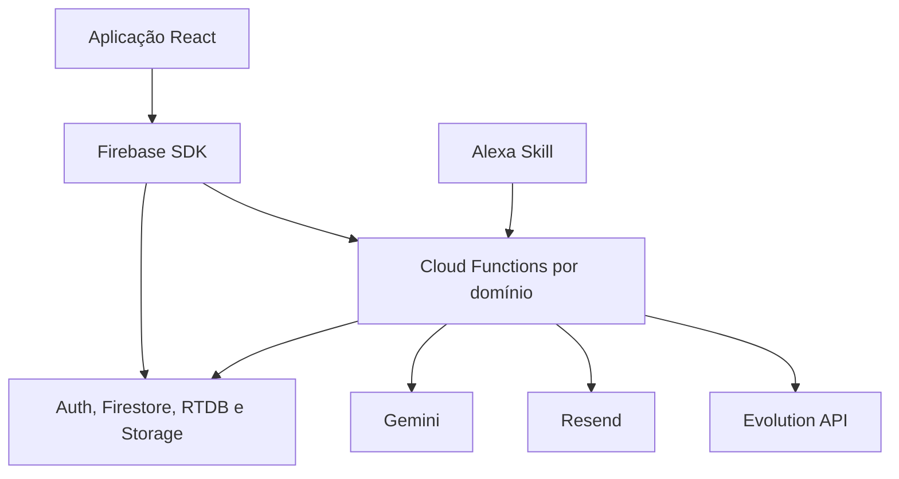

# Arquitetura e dependências

Revisão: **10/10/2026**, código `develop` / `b2b6ef9`. Este mapa descreve relações verificáveis no repositório; não substitui inventário de serviços configurados na nuvem.

## Entrypoints e execução

- Frontend: [src/main.tsx](../src/main.tsx) → [src/app/App.tsx](../src/app/App.tsx) → [rotas](../src/app/routes.tsx).
- Backend: [functions/index.js](../functions/index.js), que exporta os módulos de domínio.
- Build: [vite.config.ts](../vite.config.ts), com React/TypeScript e saída em `dist`.
- Runtime de Functions: **Node.js 22**, em [firebase.json](../firebase.json) e [functions/package.json](../functions/package.json).
- O protótipo Express foi removido. Não existe backend Studio separado no fluxo publicado por esses workflows.

```mermaid
flowchart TD
  UI["Aplicação React"] --> SDK["Firebase SDK"]
  SDK --> DATA["Auth, Firestore, RTDB e Storage"]
  SDK --> FN["Cloud Functions por domínio"]
  FN --> DATA
  FN --> AI["Gemini"]
  FN --> MAIL["Resend"]
  FN --> WA["Evolution API"]
  ALEXA["Alexa Skill"] --> FN
```

O navegador também utiliza serviços de observabilidade, consulta de CEP e URLs de mídia. O CDN de mídia é uma integração externa; não inferir configuração de cache, permissões do bucket ou disponibilidade apenas pelo domínio.

## Dependências por responsabilidade

| Área | Pacotes/serviços | Uso |
|---|---|---|
| Aplicação | React, React DOM, TypeScript, Vite, React Router | Componentes, tipagem, build e navegação |
| Interface | Tailwind, Radix, Lucide, Sonner, Motion | Estilos, componentes e feedback |
| Formulários | React Hook Form, Zod, resolvers | Entrada e validação |
| Dados | Firebase SDK | Auth, Firestore, RTDB, Storage, Analytics e Performance |
| Backend | firebase-admin, firebase-functions | Operações administrativas, callables e eventos |
| E-mail | Resend | Envio e webhook de recebimento |
| WhatsApp | Evolution API via HTTP | Envio, histórico e webhook |
| IA | Gemini via HTTP | Chat com ferramentas e análise de imagens |
| Voz | ASK SDK e verificação de requisições | Integração Alexa |
| Exportação | xlsx, jspdf, jspdf-autotable | Excel e PDF sob demanda |
| Segurança de conteúdo | DOMPurify | Sanitização de conteúdo exibido |
| Observabilidade | Sentry, Firebase Analytics/Performance | Erros e métricas do frontend |
| Testes | Vitest, Playwright, rules-unit-testing, Emulator Suite | Unitários, E2E e regras |
| Imagens | sharp | Otimização local de recursos |

Versões declaradas: [package.json](../package.json) e [functions/package.json](../functions/package.json).
Versões resolvidas: [package-lock.json](../package-lock.json) e [functions/package-lock.json](../functions/package-lock.json).
Um pacote listado não comprova que todos os seus recursos estejam habilitados. Por exemplo, dependências PWA não significam que haja um service worker ativo.

## Organização interna

| Local | Responsabilidade |
|---|---|
| `src/app/pages` e `src/app/components` | Telas, formulários e componentes |
| `src/services` | Operações e contratos de acesso Firebase |
| `src/hooks` e contextos | Assinaturas, autenticação e estado compartilhado |
| `src/app/utils` | Cálculos, formatação e regras reutilizáveis |
| `functions/users` | Contas, convites, claims, sessões e sincronização |
| `functions/orders` | Recebimento de encomendas públicas e compatibilidade legada |
| `functions/email` | Envio, recebimento, anexos, idempotência e limpeza |
| `functions/whatsapp` | Conversas, autorização, integração e persistência de eventos |
| `functions/ai` | Prompt, schemas, repositórios, ferramentas, orçamento e telemetria |
| `functions/alexa` | Identidade, diálogo, rascunhos e criação confirmada |
| `functions/common` | Utilitários, limites e parâmetros compartilhados |

## Dados principais

| Grupo | Coleções/serviço usados |
|---|---|
| Operação | `orders`, `customers`, `products`, `quotes`, `gallery`, `exchanges` |
| Histórico financeiro | `salesLedger`, `salesMonthlySummaries` |
| Precificação | `supplies`, `pricingRecipes`, `pricingSettings`, `purchaseHistory`, `productionTracking` |
| Loja | `storeProducts`, `catalogOrders`, `storeSettings` |
| Usuários | `userProfiles` e preferências em `users` |
| Atendimento | `sentEmails`, `whatsapp_chats`, `whatsapp_messages` e coleções auxiliares dos módulos |
| Presença | Realtime Database, separado do Firestore |
| Mídia | Cloud Storage e URLs de CDN |
| IA/Alexa | Registros de uso, orçamento, vínculos e rascunhos gerenciados pelos módulos |

Este quadro não é uma concessão de acesso. Regras executáveis: [Firestore](../firestore.rules), [RTDB](../database.rules.json), [Storage](../storage.rules); operações privilegiadas também validam o chamador nas Functions.

## IA: fluxo e limites

A UI envia mensagem, histórico limitado e imagem opcional a `aiAgentChat`. O backend valida a sessão, resolve escopo, reserva orçamento, prepara contexto autorizado e chama o modelo com as ferramentas declaradas. As ferramentas consultam dados ou retornam rascunhos; handlers montam boa parte das respostas de forma determinística.

Quando várias ferramentas são chamadas, pode haver uma rodada adicional de síntese. A configuração limita o trabalho por solicitação. Consultas de pedidos percorrem páginas até um teto operacional; limitar a lista exibida não garante uma quantidade equivalente de leituras no Firestore.

O cache é em memória e não é compartilhado por todas as instâncias. Orçamento e telemetria possuem persistência própria. Veja [Copiloto](COPILOTO_IA.md).

## Publicação e configuração

A [configuração Firebase](../firebase.json) aponta para regras e índices versionados. O workflow [DEV](../.github/workflows/deploy-dev.yml) pode publicar Hosting, Functions, Firestore/RTDB/Storage e índices. O [workflow de produção](../.github/workflows/deploy.yml) publica o frontend; o [workflow manual de Functions](../.github/workflows/deploy-functions-manual.yml) trata o backend.

Parâmetros secretos devem ser fornecidos pelos mecanismos de secrets do ambiente. Templates públicos devem conter somente nomes e placeholders. Rotação, permissões de contas de serviço e estado de deploy precisam ser verificados na infraestrutura; não são comprovados por este documento.

## Custo e evolução

- Paginar antes da leitura evita carregar coleções inteiras para depois usar `slice`.
- O histórico completo usado por telas e agregações merece medição de leituras, latência e crescimento.
- Carregar contexto de catálogo em cada solicitação de IA pode custar leituras e tokens mesmo para perguntas simples.
- Limitar o tamanho do prompt, reutilizar dados dentro da mesma requisição e usar respostas determinísticas pode reduzir trabalho; a economia deve ser medida.
- Índices e resumos materializados exigem contratos de atualização, recomputação e definição de período.
- Agrupar modelos sob uma única tarifa ou ignorar tentativas de fallback pode distorcer a estimativa de IA.

A revisão documental executou **771 testes unitários em 73 arquivos**, todos aprovados. Não realizou teste de carga, validação de faturamento real, E2E remoto ou nova auditoria dos serviços publicados.
