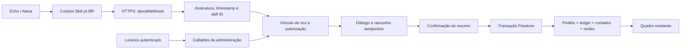

# Pedidos por Alexa no Luisices — especificação para implementação

Data: 27/09/2026. Base analisada: `0aca8fc`, após pull de `origin/develop` na branch `feature/novo-visual-luisices`.
Este documento especifica a implementação; nenhuma integração foi implantada.

## 1. Resultado esperado e decisões

Permitir que pessoas previamente autorizadas criem pedidos por voz em português brasileiro. Quando Amanda falar, o servidor deverá resolver sua identidade cadastrada e criar o pedido com `userId = UID_DA_AMANDA`, após conferir os dados com ela. Pessoas desconhecidas não poderão criar pedidos nem rascunhos no quadro.

Decisões para a primeira versão:

- Custom Skill Alexa em `pt-BR`, com intents e slots, sem modelo generativo no caminho de criação.
- HTTPS direto para Firebase Cloud Functions, usando Firestore e autenticação já existentes.
- Duas skills independentes: produção e teste; dois projetos Firebase, já previstos no repositório.
- Vínculo de perfil de voz aprovado no Luisices por administrador. Reconhecer a conta do aparelho não basta.
- Confirmação verbal obrigatória do resumo antes da gravação. “Automático” significa escolher o espaço correto e gravar sem preencher o formulário web.
- Um pedido com um produto por conversa no MVP; pagamento sempre pendente, sem cobrança, mensagens ou movimentação de estoque.
- Negação por padrão: falta de identidade, permissão ou configuração válida impede gravação.

**Limite de segurança:** reconhecimento de voz é um sinal de identidade sujeito a falhas. Não oferece garantia absoluta contra imitação, gravações ou reconhecimento incorreto. Para quem exige proteção adicional, disponibilizar aprovação no Luisices antes de criar o pedido. O modo somente por voz deve ser uma escolha explícita do administrador para aquela pessoa.

## 2. Como encaixar no projeto atual

| Componente existente | Uso na implementação |
| --- | --- |
| React/TypeScript, `src/app/pages/Settings.tsx` e `Users.tsx` | Configuração da integração e autorização de pessoas |
| Firebase Auth e `userProfiles` | Identidade interna, perfil ativo e permissões |
| `src/services/firebaseOrderService.ts` | Contrato atual de pedido e transação de criação |
| `src/services/firebaseLedgerService.ts` | Mapeamento do pedido para histórico financeiro |
| `src/contexts/OrdersContext.tsx` | Exibição por proprietário/responsável e atualização em tempo real |
| `src/app/types.ts` e `src/app/schemas/validationSchemas.ts` | Tipos, limites e validação de campos |
| `functions/index.js`, Node.js 22 | Registro das novas functions, delegando a módulos separados |
| `functions/ai/*` | Referência de organização; não acoplar autorização Alexa à permissão de IA |
| `firestore.rules` e `firestore.indexes.json` | Proteger as novas coleções e consultas administrativas |
| `.firebaserc` | Produção `papelaria-dashboard`; desenvolvimento `luisices-dev` |

O sistema usa `orders.userId`; não foi identificada necessidade de criar uma entidade nova de workspace. O pedido da Amanda será de propriedade dela; `assignedTo` será `null` no MVP. O administrador continuará podendo vê-lo na visão global e no filtro da Amanda. Isso não transforma o espaço dela em privado para administradores.

A versão atual grava contador, pedido e `salesLedger` na mesma transação. Preservar essa garantia no backend Alexa. O serviço atual depende de `auth.currentUser` no navegador: não importá-lo diretamente em Cloud Functions. Extrair funções puras de validação/mapeamento ou criar equivalente no servidor com testes de paridade. Evitar refatoração ampla do fluxo web.

## 3. Arquitetura

Usar `onRequest` v2 para o webhook e `onCall` para administração. Selecionar versão compatível do ASK SDK e de seu verificador de requisições; fixar versões no lockfile e revisar compatibilidade com Node.js 22. Preservar `req.rawBody` para validar os bytes originais antes do processamento de negócio. Não introduzir Lambda, API Gateway, n8n, Redis, IA ou servidor permanente no MVP.

O endpoint deve ser alcançável pela Alexa; a autenticação será a verificação criptográfica das requisições, combinada com a autorização interna. Firebase App Check não substitui esse mecanismo e não deve ser exigido da Alexa. Nas callables do app, exigir Firebase Auth e aplicar App Check conforme a configuração do projeto.

## 4. Identidade, vínculo e autorização

### 4.1 Identidade recebida

`context.System.user.userId` identifica a conta Amazon ativa no aparelho. `context.System.person.personId`, quando disponível, identifica o perfil reconhecido. Solicitar `alexa::person_id:read`. A personalização depende de consentimento e de reconhecimento efetivo; ausência de `personId` deve encerrar a tentativa com orientação, sem usar a conta do aparelho como fallback. [Documentação de personalização](https://developer.amazon.com/en-US/docs/alexa/custom-skills/add-personalization-to-your-skill.html).

Chave lógica do vínculo: `(environment, applicationId, amazonUserId, personId)`. Persistir uma chave HMAC-SHA256 dessa composição usando segredo por ambiente. Não usar nome pronunciado, e-mail ditado ou `deviceId` como identidade de pessoa. O nome Amanda vem de `userProfiles`, após resolver o vínculo.

### 4.2 Cadastro inicial de Amanda: pareamento supervisionado

Para manter baixo o custo de implementação, o MVP usará pareamento próprio supervisionado, sem implementar um provedor OAuth. Não chamar esse fluxo de OAuth Account Linking.

1. Administrador ativo abre “Configurações → Alexa”, escolhe o UID da Amanda e habilita sua permissão de criação por voz. Exigir também `permissions.orders.create === true`; funcionários normalmente precisam receber essa permissão explicitamente.
2. Amanda configura seu perfil de voz e permite personalização no aplicativo Alexa.
3. Na presença do administrador, Amanda diz “Alexa, abrir luisices de teste” e “vincular minha voz”.
4. O webhook validado recebe `personId` e gera desafio aleatório de oito dígitos, validade de cinco minutos e uso único. Fala os dígitos separadamente. Não gerar desafio se não houver pessoa reconhecida.
5. O administrador digita esse código no Luisices e confirma o usuário e o ambiente. A associação é consumida e criada em transação. Não permitir que a Alexa escolha o UID.
6. Fazer uma tentativa de pedido com Amanda e outra com pessoa não cadastrada antes de ativar uso automático.

Esse cadastro atesta a associação observada pelo administrador; o código não prova sozinho que a voz pertence à Amanda. Não permitir ativação remota automática por simples posse do código. Armazenar apenas HMAC do código, tentar no máximo cinco códigos por administrador em cinco minutos e limitar geração por conta/dispositivo. Regeneração invalida desafio anterior; colisões devem ser detectadas e regeneradas.

Novas identidades não sobrescrevem vínculos ativos silenciosamente. Reinstalação da skill ou alteração do identificador exige novo pareamento supervisionado. Revogação deve ter efeito na próxima operação de criação.

Para futura distribuição pública em escala, avaliar OAuth 2.0 Authorization Code com Account Linking por pessoa; não implementar OAuth improvisado usando um token Firebase como código ou refresh token. Esse trabalho é uma fase separada.

### 4.3 Política obrigatória no servidor

Antes de coletar dados privados e novamente na transação de criação, verificar:

- Skill e projeto correspondem ao ambiente configurado; integração global habilitada.
- Vínculo existente, ativo e correspondente à pessoa da requisição atual.
- Usuário Firebase existente/não desativado e perfil com `active === true`. Para voz, perfis legados sem `active` exigem regularização explícita.
- `permissions.orders.create === true` e autorização de voz ativa, inclusive para administradores.
- Escopo `orders:create:self`; destino sempre igual ao UID vinculado.
- Dispositivo permitido, quando a instalação estiver configurada com lista de dispositivos.
- Limites de uso e modo de confirmação atendidos.

As regras Firestore não são aplicadas ao Admin SDK. Implementar essas verificações no backend, sem confiar em `sessionAttributes`, slots, payload do navegador ou permissões em cache. Na confirmação, a pessoa deve ser a mesma que iniciou o pedido. Se outra pessoa disser “sim”, negar; se `personId` desaparecer, negar também.

Modos por pessoa:

- `voice_confirm`: pessoa vinculada, permissão explícita e confirmação verbal do resumo. Recomendado para o uso doméstico proposto após validação real.
- `app_approval`: a voz prepara uma solicitação; o próprio titular autenticado a aprova no Luisices. Somente essa aprovação cria `orders` e `salesLedger`. É a alternativa quando a confiança da identificação de voz não é suficiente.

Se `personId` não funcionar no aparelho/locale utilizado, bloquear o fluxo automático. Uma alternativa com aprovação web exige um vínculo de conta/dispositivo configurado pelo administrador e deve ser apresentada como outro modo, sem alegar reconhecimento da Amanda.

PIN nativo é uma evolução opcional condicionada à disponibilidade na conta, aparelho e locale. Usar o fluxo oficial `AMAZON.VerifyPerson/2`, tratar retorno e correlacioná-lo ao rascunho. Não criar um slot de senha ou guardar PIN pronunciado. [PIN Confirmation](https://developer.amazon.com/en-US/docs/alexa/custom-skills/pin-confirmation-for-alexa-skills.html).

## 5. Conversa e validação

Exemplo de entrada confiável para testes:

> Amanda: “Alexa, abrir luisices de teste.”
>
> Alexa: “Ambiente de teste. Diga criar pedido.”
>
> Amanda: “Criar pedido de vinte caixinhas para Maria.”
>
> Alexa: “Qual é a data de entrega?”
>
> Amanda: “Dez de outubro.”
>
> Alexa: “Qual é o valor total do pedido?”
>
> Amanda: “Cem reais.”
>
> Alexa: “Amanda, no ambiente de teste: vinte caixinhas para Maria, entrega em dez de outubro de 2026, total de cem reais. Confirmar?”
>
> Amanda: “Sim.”
>
> Alexa: “Pedido criado no seu espaço de teste.”

Validar também a invocação em uma frase, como “Alexa, peça ao luisices de teste para criar um pedido”. A frase desejada “criar pedido no luisices de teste” é uma candidata a testar; não prometer que qualquer ordem de palavras invocará a skill. O nome “luisices” precisa ser validado por pronúncia e pelas regras de invocation name antes de fixar os exemplos definitivos.

### Intents

| Intent | Finalidade |
| --- | --- |
| `CreateOrderIntent` | Iniciar/coletar os campos do pedido |
| `ProvideCustomerIntent`, `ProvideProductIntent` | Informar/corrigir cliente e produto |
| `ProvideQuantityIntent`, `ProvideDeliveryDateIntent`, `ProvideTotalIntent` | Informar/corrigir os valores |
| `LinkVoiceIntent` | Iniciar pareamento supervisionado |
| `AMAZON.YesIntent` / `AMAZON.NoIntent` | Confirmar o resumo vigente ou voltar à correção |
| `AMAZON.CancelIntent`, `AMAZON.StopIntent` | Cancelar sem criar pedido |
| `AMAZON.HelpIntent`, `AMAZON.FallbackIntent` | Orientação e recuperação de fala não entendida |

Usar `AMAZON.NUMBER` e `AMAZON.DATE` onde compatíveis com `pt-BR`; produto pode usar tipo customizado com sinônimos. Para cliente/produto livres, validar no build quais tipos de slot são suportados e suas restrições; captura livre pode exigir um turno dedicado. Não depender de vários slots de texto livre na mesma frase. Preço em reais/centavos deve ter gramática e testes próprios, sem pressupor que NUMBER interpreta toda expressão monetária.

Campos obrigatórios: cliente, produto, quantidade inteira positiva, data completa e preço total explícito. Não inventar preço, telefone, cliente cadastrado ou prazo. Telefone opcional será `''`; `customerId` poderá ser `null`. Não criar cadastro de cliente automaticamente. Se resolver cliente existente, restringir a busca ao escopo autorizado e pedir desambiguação para homônimos.

Aplicar os limites existentes: cliente 2–100 caracteres, produto 1–200, quantidade 1–10.000, preço 0–1.000.000 e observações até 1.000. Para preço zero, perguntar explicitamente se o pedido é gratuito; preço ausente não vira zero. Calcular dinheiro em centavos e converter para o formato numérico atual na persistência; `price` representa total, não unitário.

Configurar timezone por instalação, inicialmente `America/Sao_Paulo`, sujeito à confirmação na tela. Resolver “amanhã” nesse fuso; intervalos, datas incompletas/ambíguas ou passadas exigem esclarecimento. Armazenar `deliveryDate` no formato civil `YYYY-MM-DD`; timestamps de auditoria em UTC. Repetir dia, mês e ano no resumo.

Máquina de estados: `collecting → awaiting_confirmation → committed`, com saídas `cancelled`, `expired` e `awaiting_app_approval`. Cada correção invalida a confirmação anterior. “Sim” sem rascunho válido não cria nada. Expirar rascunhos após 15 minutos e conferir validade no servidor, independentemente do atraso da limpeza TTL. Após três falhas de entendimento, encerrar com orientação para usar o app.

## 6. Persistência e contratos

Coleções novas, todas privadas para escrita pelo cliente:

| Caminho proposto | Conteúdo mínimo |
| --- | --- |
| `integrationSettings/alexa` | enabled, environment, allowedSkillId, timezone, limites |
| `alexaPermissions/{uid}` | enabled, mode, scope, approvedBy, updatedAt |
| `alexaBindings/{bindingKey}` | uid, active, environment, approvedBy, createdAt, revokedAt, dispositivos autorizados |
| `alexaPairings/{codeHmac}` | bindingKey, identidade pseudonimizada, expiresAt, consumedAt |
| `alexaDrafts/{draftId}` | uid, bindingKey, sessionKey, campos validados, revision, state, expiresAt |
| `alexaRequests/{requestKey}` | draftId, resultado seguro, orderId, expiresAt |
| `alexaCommits/{draftId}` | orderId, revision, committedAt; recibo durável de consumo |
| `alexaRateLimits/{bucketKey}` | contador, janela, expiresAt |
| `alexaAudit/{eventId}` | evento, uid quando conhecido, motivo, orderId, duração, timestamp |

IDs externos usados como chaves devem passar por HMAC/hash, sem barras e sem dados sensíveis. Não armazenar áudio nem envelope completo; slots pertencem somente ao rascunho/pedido. `sessionAttributes` transportam no máximo ID opaco e revisão; o servidor mantém a verdade.

Adicionar ao pedido campos opcionais e retrocompatíveis: `source: 'alexa'`, `createdByUid`, `voiceDraftId`, `voiceConfirmationMode`. Manter identidades Amazon nas coleções privadas. Atualizar mapeamentos do frontend para exibir selo “Alexa”, sem expor identificadores externos.

### Transação de criação

1. Resolver autorização e identidade da requisição; carregar perfil, vínculo, permissão e configuração dentro da transação para detectar revogação concorrente.
2. Ler recibo `alexaCommits/{draftId}`. Se já existe, devolver o mesmo resultado autorizado, sem criar outro pedido.
3. Ler rascunho, conferir titular, ambiente, estado, prazo, sessão e revisão confirmada; conferir limite transacional de criação.
4. Ler contador em `users/{uid}/metadata/counters`; manter a sequência compartilhada com o formulário web.
5. Gerar referência de pedido uma vez, fora de callbacks que possam repetir. Gravar contador, `orders`, `salesLedger/{orderId}`, consumo do rascunho, recibo e evento de criação na mesma transação. Fazer todas as leituras antes das escritas.
6. Só responder “criado” depois do commit confirmado.

Preservar `status: 'pending'`, workflow de sete etapas, `version: 1`, `deletedAt: null` e formatos atuais. Pagamento: total igual ao preço, pago zero, restante igual ao total e status pendente. Não marcar como pago por voz no MVP.

Idempotência tem dois níveis: chave da requisição Alexa `(skillId, requestId)` para reentrega; `draftId` consumido para “sim” repetido com outro requestId. Reter o recibo de consumo para impedir recriação mesmo se o pedido for removido. Duas confirmações simultâneas resultam em um pedido e um lançamento financeiro. Uma nova conversa intencional pode criar pedido igual; não deduplicar apenas pelo texto.

Se houver timeout depois do commit, recuperar o resultado pelo recibo na repetição. Se o resultado ainda for incerto, dizer que não foi possível confirmar e orientar a consulta ao quadro; não afirmar que falhou nem sugerir recriação imediata.

### API administrativa proposta

- `createAlexaPairing` é executada internamente pelo intent autenticado da skill.
- `approveAlexaPairing({ code, targetUid })`: callable apenas para administrador ativo; verifica usuário alvo e consome código.
- `setAlexaPermission({ uid, enabled, mode })`: apenas administrador ativo.
- `revokeAlexaBinding({ bindingId })`: administrador ou próprio titular; titular só pode revogar.
- `getAlexaIntegrationStatus()`: visão própria ou administrativa, sem segredos.
- `approveAlexaDraft({ draftId, revision })`: apenas titular autenticado, modo `app_approval`; usa a mesma transação.

Retornar erros de negócio estáveis (`VOICE_NOT_RECOGNIZED`, `VOICE_NOT_ALLOWED`, `ENVIRONMENT_MISMATCH`, `DRAFT_EXPIRED`, `RATE_LIMITED`) e mensagens curtas em português. Erros criptográficos retornam HTTP 400/401 sem consultar dados de pedidos; recusas de negócio em requisição Alexa válida podem retornar envelope Alexa HTTP 200 com fala adequada.

## 7. Proteção do endpoint, dados e custos de abuso

- Validar assinatura sobre corpo original, cadeia e validade do certificado, origem permitida da URL do certificado, timestamp com tolerância máxima de 150 segundos e application ID exato. Usar verificador mantido do ASK SDK; não escrever criptografia própria. [Requisitos de HTTPS da Amazon](https://developer.amazon.com/en-US/docs/alexa/custom-skills/host-a-custom-skill-as-a-web-service.html).
- Aceitar POST com JSON, limite inicial de corpo 128 KiB, tipos de request conhecidos e `pt-BR`. Sanitizar/escapar texto em SSML; não interpolar conteúdo de slots como marcação.
- Não usar CORS, URL secreta, chave no frontend ou allowlist de IP como autenticação da Alexa.
- Credencial de serviço gerenciada, com acesso somente ao projeto correto; nenhum JSON de service account no repositório ou no aparelho. Segredos HMAC no Secret Manager.
- Regras negam leitura/escrita direta nas coleções técnicas. Consultas administrativas via callables com escopo. As permissões de voz ficam fora de campos que o próprio usuário possa editar.
- Limites iniciais configuráveis: 30 requests/minuto por vínculo; 10 pedidos/hora e 50/dia por pessoa; 5 pareamentos/hora por conta/dispositivo. Negados não gastam a cota de pedidos. Contadores distribuídos/transacionais no Firestore; limiter em memória sozinho não é suficiente em múltiplas instâncias.
- Requisições inválidas são rejeitadas antes de leituras Firestore. Limitar instâncias e monitorar tráfego anormal; adicionar proteção de borda somente se o volume justificar seu custo. Esses limites reduzem abuso, mas não são teto absoluto de faturamento do endpoint público.
- Logs estruturados sem códigos, tokens, telefone, nomes completos, slots ou IDs Amazon brutos. Auditoria inicial por 30 dias; rascunhos expirados e desafios via TTL; cache de requests por 24 horas. Recibos duráveis contêm apenas o mínimo para idempotência.
- Informar no app que a fala é processada pela Amazon; excluir dados locais não apaga o histórico de voz mantido na conta Alexa. Disponibilizar revogação e política de privacidade antes de distribuição externa.

## 8. Desenvolvimento isolado de produção

| Item | Desenvolvimento | Produção |
| --- | --- | --- |
| Projeto Firebase | `luisices-dev` | `papelaria-dashboard` |
| Aplicação | `dev.luisices.com.br` | `luisices.com.br` |
| Skill ID | exclusivo de teste | exclusivo de produção |
| Invocation name candidato | `luisices de teste` | `luisices` |
| Endpoint | function no projeto dev | function no projeto prod |
| Dados, vínculos e segredos | exclusivos de dev | exclusivos de prod |

Ambiente é determinado pelo deployment e validado contra skill ID/projeto. Nunca usar slot “teste”, query string ou texto pronunciado para selecionar banco. Se alguém pedir “de teste” dentro da skill de produção, recusar a criação e instruir a abrir a skill de teste; não redirecionar silenciosamente.

Manter configuração explícita `ALEXA_ENVIRONMENT`, `ALEXA_SKILL_ID`, `ALEXA_ENABLED`, `ALEXA_TIMEZONE` e segredo `ALEXA_IDENTITY_HMAC_KEY`. IDs reais são preenchidos pelo operador; não inventá-los. Validar configuração no startup e negar em caso de combinação desconhecida. Não usar fallback automático para produção.

### Roteiro de validação

1. Testes locais com Firebase Emulator Suite e projeto `demo-*`, sem credenciais de produção. Fixtures sintéticas de Amanda e usuário não autorizado.
2. Testes de domínio podem chamar handlers internos com envelopes sintéticos. O endpoint HTTP implantado nunca terá `skipSignatureValidation` nem modo de identidade simulada.
3. Implantar somente novas functions/regras necessárias em `--project luisices-dev`, usando seletores explícitos. Não usar o script genérico que implanta todas as functions e remove versões de segredos.
4. Criar skill de teste, definir endpoint HTTPS, locale `pt-BR`, personalização, intents e slots; fazer build e ativar testing em Development.
5. Testar diálogo no simulator. Testar assinaturas no tráfego real da Alexa; um POST manual do console não prova validação criptográfica.
6. Habilitar a skill de desenvolvimento em um Echo da conta de desenvolvimento elegível. Validar a disponibilidade de personalização e as vozes reais da Amanda e de outra pessoa.
7. Confirmar que o pedido aparece apenas no projeto dev e no espaço da Amanda; conferir que produção permanece sem alterações.
8. Registrar evidência sem dados privados: aparelho, locale, cenário, resultado, latência e versão implantada.

O console permite testes antes da publicação. Simulator não substitui teste de reconhecimento no Echo. Verificar elegibilidade da conta/dispositivo e os caminhos de habilitação descritos pela Amazon. [Testes no Developer Console](https://www.developer.amazon.com/en-US/docs/alexa/devconsole/test-your-skill.html).

Para outras contas Amazon, definir distribuição por beta/publicação conforme as regras vigentes; não assumir que uma skill em desenvolvimento fica disponível a qualquer convidado. Mesmo publicada, a autorização do backend continua fechada aos usuários cadastrados. [Teste e depuração de custom skills](https://developer.amazon.com/en-US/docs/alexa/custom-skills/test-and-debug-a-custom-skill.html).

## 9. Velocidade e custo

Metas propostas, a medir: p95 do backend quente até 1,5 segundo por turno e p95 de resposta completa até 5 segundos, incluindo inicialização quando ocorrer. Definir orçamento interno de 6 segundos para evitar ultrapassar a janela da Alexa. A Amazon informa aproximadamente 8 segundos para a resposta completa; resposta progressiva não estende essa janela. [Limite de resposta](https://developer.amazon.com/en-US/docs/alexa/custom-skills/send-the-user-a-progressive-response.html).

Configuração inicial: `minInstances: 0`, `maxInstances: 2`, 256 MiB como ponto de partida a validar com CPU/concurrency compatíveis da geração escolhida. Região próxima do Firestore existente; medir também latência do serviço Alexa. Importar apenas módulos necessários, reutilizar conexões e cachear certificados conforme validade. Não cachear autorização de criação. Aumentar memória ou usar uma instância mínima somente se as medições justificarem custo recorrente.

Não há chamada Gemini/OpenAI, transcrição adicional ou assinatura de automação no MVP. A economia vem de reaproveitar Firebase e da ausência de processamento generativo.

Planilha de custo a entregar com a implementação:

| Cenário mensal | Pedidos | Turnos médios | Invocações mínimas estimadas |
| --- | ---: | ---: | ---: |
| Pessoal | 300 | 6 | 1.800 |
| Pequena equipe | 1.000 | 6 | 6.000 |
| Maior uso | 3.000 | 6 | 18.000 |

Acrescentar aberturas, recusas, pareamentos e retries. Medir leituras/escritas por turno e por commit; incluir listeners do quadro, Auth, Firestore, execução CPU/memória, rede, armazenamento, TTL, logs, Secret Manager e artefatos de deploy. Multiplicar pelas tarifas vigentes na região, considerando consumo agregado do projeto. Cloud Functions exige plano compatível com faturamento; a franquia gratuita não garante custo zero. [Preços oficiais Firebase](https://firebase.google.com/pricing).

Meta inicial de produto: tentar manter custo incremental até R$ 10/mês em uso pessoal; é um orçamento alvo, não uma cotação. Entregar estimativa em moeda da cobrança e conversão identificada antes de produção. Configurar alertas de orçamento e chave global de desligamento; alertas não interrompem cobrança automaticamente. Não contratar componentes adicionais sem necessidade demonstrada.

## 10. Interface no Luisices

Em “Configurações → Alexa”: ambiente destacado, estado da integração, instruções de vinculação e botão de desligamento global para admin. Em usuários: autorização de voz, modo de confirmação, limites e ação revogar.

Administrador vê os vínculos aprovados e eventos recentes com motivos legíveis. O titular vê seu vínculo e pode revogá-lo. Para `app_approval`, apresentar solicitações pendentes em seção própria com resumo, expiração e botões aprovar/rejeitar. Elas não entram no quadro nem nos relatórios antes de aprovação.

Pedidos criados mostram selo “Alexa” e mantêm edição/exclusão normais pelo sistema. Não alterar o filtro global do administrador para esconder pedidos reais da Amanda. O objetivo de evitar poluição é impedir pedidos não autorizados, incompletos, repetidos e de teste.

## 11. Critérios de aceite e testes obrigatórios

| Cenário | Resultado esperado |
| --- | --- |
| Amanda vinculada e autorizada confirma | Um pedido próprio, um ledger e um incremento de contador |
| Outro usuário autorizado fala | Pedido pertence ao UID dessa pessoa |
| Visitante diz “sou Amanda” ou “no espaço da Amanda” | Nenhuma criação nem troca de proprietário |
| Conta/aparelho autorizado, pessoa desconhecida | Nenhuma criação |
| Pessoa sem `orders.create` ou sem permissão de voz | Negação, inclusive se admin |
| Perfil inativo, Auth desativado ou vínculo revogado | Negação |
| Revogação entre coleta e confirmação | Negação no commit |
| Outra pessoa confirma ou `personId` desaparece | Negação |
| Preço ausente, quantidade inválida, data ambígua | Pedir correção; nenhum pedido parcial |
| Cancelar, silêncio ou expiração | Nenhum pedido/ledger |
| Retry, dois “sim”, requests concorrentes | Um único pedido |
| Timeout após commit e retry | Recuperar mesmo pedido |
| Alteração do resumo após confirmação | Exigir nova confirmação da revisão correta |
| Requisição sem assinatura, adulterada ou antiga | Rejeitar antes de consulta de negócio |
| Certificado/URL maliciosos | Rejeitar sem requisição arbitrária à rede |
| Skill de teste no endpoint prod e vice-versa | Rejeitar |
| Execução no ambiente de teste | Zero escrita/efeito externo em produção |
| Código expirado, repetido, errado ou concorrente | Sem vínculo indevido |
| Cliente tenta editar autorização/coleção técnica | Firestore Rules negam |
| Pedido web e Alexa simultâneos | Contador consistente e sem número duplicado para o mesmo UID |
| App approval sem titular correto | Nenhuma criação |
| Rascunho já consumido e pedido removido | Não recriar |
| Limites excedidos e múltiplas instâncias | Bloqueio consistente |

Adicionar testes unitários em `tests/unit/alexa`, integração com emulador e testes de interface para permissão/aprovação. Reaproveitar os scripts `test:unit`, `test:integration`, `typecheck` e `build`; ajustar configuração para executar as novas suítes. Não considerar o script de lint das functions, atualmente sem validação real, evidência suficiente.

Entregar testes de regressão da criação web e do ledger. Medir latência quente/fria e número de operações com tráfego de teste, sem prometer metas antes de medir. O teste físico com Amanda e uma segunda pessoa é requisito para liberar o modo automático.

## 12. Entregáveis e ordem de implementação

1. **Prova de viabilidade em dev:** confirmar invocation name, slots `pt-BR`, disponibilidade de `personId` e reconhecimento no aparelho real. Se falhar, documentar a limitação antes de desenvolver a experiência completa.
2. **Backend:** `functions/alexa/{index,verification,authorization,pairing,dialog,repository,rateLimit}.js` e serviço de domínio para criar pedidos com a transação descrita.
3. **Pacote da skill:** `alexa/skill-package/interactionModels/custom/pt-BR.json`, manifests/configurações por ambiente e fixtures sem identidades reais.
4. **Administração:** componente `AlexaSettingsSection`, serviço cliente para callables, permissões separadas, revogação e aprovação web.
5. **Compatibilidade:** tipos e mapeamentos de origem, regras/índices e preservação de contador, ledger, filtros e fluxo web.
6. **Verificação:** testes automatizados, roteiro de Echo real e relatório de latência/custo.
7. **Operação:** documentação de configuração/deploy explícito por projeto, desligamento, reversão de versão e expiração de dados. Desligar integração não apaga pedidos existentes.

Produção permanece desabilitada até concluir testes e preencher IDs/configurações reais. A implementação deve entregar o código e a configuração revisáveis antes de qualquer ativação de produção.

## 13. Solicitação pronta para o Antigravity

> Implemente pedidos por Alexa no Luisices seguindo integralmente `docs/ESPECIFICACAO_ALEXA_ANTIGRAVITY.md`. Comece pela prova de viabilidade em `pt-BR` e reavalie o código atual, pois a especificação foi preparada sobre `0aca8fc`.
>
> Use Custom Skill com HTTPS direto nas Firebase Cloud Functions, sem LLM no fluxo. Separe as skills e projetos de teste e produção. Faça vínculo supervisionado e revogável de `personId` ao UID interno; nunca trate a conta do aparelho ou nome falado como pessoa autenticada. Amanda deve criar no próprio `userId`, depois de confirmar o resumo.
>
> Exija autorização explícita, perfil ativo e permissão `orders.create`, com validação no servidor antes do commit. Implemente rascunho fora do quadro, proteção contra troca de pessoa, assinatura Amazon, antirreplay, rate limit distribuído e idempotência por requisição e por rascunho. Grave pedido, contador, ledger e recibo em transação única, compatível com o fluxo web existente.
>
> Entregue tela de configuração/revogação, modo opcional de aprovação no app, pacote da skill, testes e roteiro para “Alexa, abrir luisices de teste”. Não permita que texto falado escolha o banco. Valide pessoalmente no Echo a presença de `personId`; se não for possível, reporte como pendência, sem substituir por nome ditado ou identidade fixa.
>
> Ao terminar, liste arquivos alterados, decisões, testes efetivamente executados, passos manuais pendentes, medições de latência e estimativa de custo. Não declare a integração validada sem teste real nem ative produção automaticamente.
