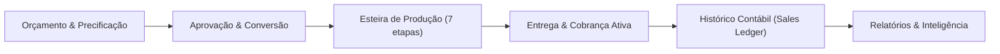
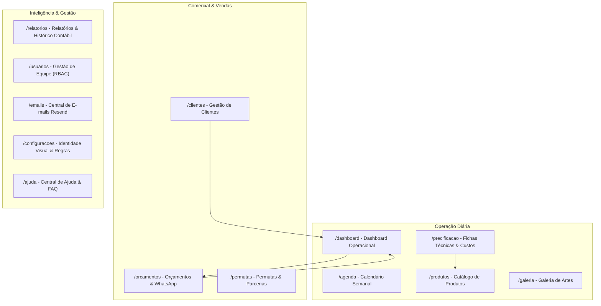
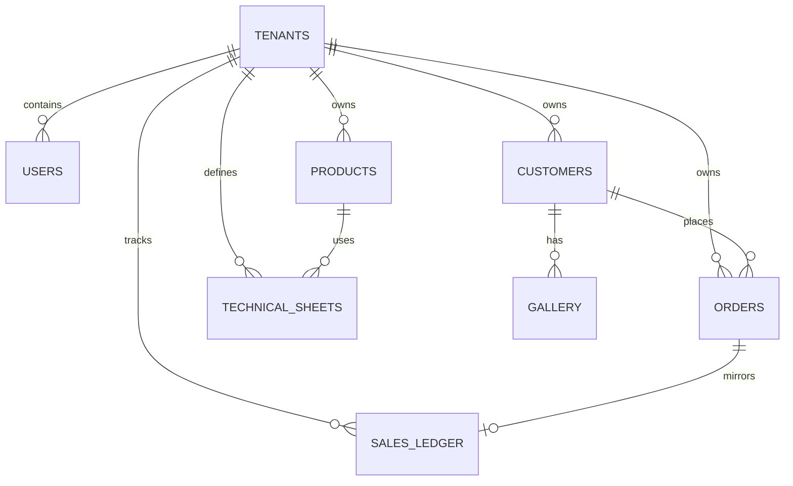
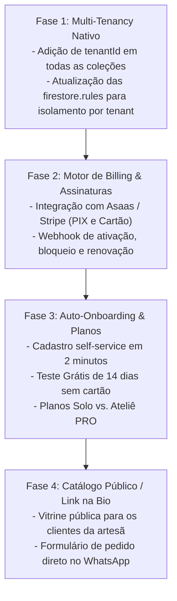

# 📐 Documento de Design e Arquitetura do Sistema — Luisices

> **Versão:** 2.4.0 (Atualizado para SaaS-Ready & Workflow Multi-Tenant)  
> **Status:** Ativo / Em Produção  
> **Público-alvo do Documento:** Engenharia de Software, Designers de Produto, Arquitetos de Solução e Agentes de IA (Stitch / Google Cloud).

---

## 1. Visão Geral do Produto

O **Luisices** é uma plataforma de gestão e automação operacional projetada especificamente para o ecossistema de **papelaria personalizada, cartonagem, sublimação, festas e ateliês criativos sob encomenda**.

Diferente de ERPs tradicionais de caixas fechadas ou ferramentas genéricas de quadros (como Trello), o Luisices resolve o ciclo de vida completo de produtos sob medida: desde a **precificação fracionada de insumos** e aprovação de artes com o cliente até as **7 etapas de produção física**, controle de prazos críticos de eventos e **histórico financeiro contábil independente**.

---

## 2. Pilares Arquiteturais e Stack Tecnológica

### 2.1 Stack Frontend
* **Core:** React 18 com TypeScript e Vite.
* **Roteamento:** React Router v7 com carregador resiliente dinâmico (`lazyWithRetry`) e recuperação automática de cache de chunks.
* **Estilização & Design System:** Tailwind CSS, Radix UI Primitives (estilo shadcn/ui), animações com transições CSS suaves.
* **Linguagem Visual:** *Glassmorphism* (superfícies translúcidas com `backdrop-blur`, bordas suaves com `border-border/60`, paleta adaptativa claro/escuro e 6 paletas de acento personalizáveis).
* **Gráficos & Visualização:** Recharts (AreaChart, PieChart, BarChart) adaptados com tooltips personalizados.
* **Ícones:** Lucide React.
* **Notificações:** Sonner (toasts modernos com suporte a ações e dismiss).
* **Validação:** Zod com schemas tipados para formulários de clientes, pedidos, insumos e usuários.

### 2.2 Stack Backend & Cloud (Serverless)
* **Autenticação:** Firebase Authentication (e-mail/senha, recuperação segura e convites validados por hash).
* **Banco de Dados:** Cloud Firestore (NoSQL em tempo real com `IndexedDB persistence` para cache offline gratuito no navegador).
* **Armazenamento de Arquivos:** Firebase Storage (anexos de pedidos e fotos da galeria em alta resolução).
* **Serverless Functions:** Cloud Functions for Firebase (Node.js 20) com endpoints protegidos (`isAdminRequest`, webhook Resend/Svix criptograficamente verificado).
* **E-mails Transacionais:** Resend API oficial + Webhooks em tempo real com sincronização de cota.
* **Mensageria WhatsApp:** Integração com Evolution API e deep links nativos `https://wa.me/` com templates customizáveis.

---

## 3. Arquitetura da Informação e Módulos do Sistema

---

## 4. Detalhamento dos Módulos Principais

### 4.1 Dashboard Operacional (`/dashboard`)
Projetado para ser a central do **"Aqui e Agora"** do ateliê, sem desviar a atenção para dados contábeis passados distantes:
* **Métricas do Mês Vigente (Dinâmicas):**
  * `Receita (Mês Atual)`: Faturamento consolidado do mês corrente (ex.: *Setembro*), alimentado pelo `salesLedger` para preservar pedidos arquivados, indicando a quantidade de vendas concluídas no mês.
  * `Recebido (Mês Atual)`: Total efetivamente pago no mês vigente.
  * `Ticket Médio (Mês Atual)`: Média do mês, com **descarte automático de pedidos cancelados**.
* **Métricas da Operação Ativa:**
  * `A Receber`: Valor pendente estritamente de pedidos ativos na esteira (quem ainda não pagou).
  * `Total em Aberto`: Valor de pedidos pendentes ou em produção aguardando entrega.
  * `Em Produção` e `Total de Pedidos`.
* **Paginação Inteligente e Densidade:**
  * Seletor de itens por página: `Exibir: [ 6 | 12 | 24 | Todos ]`, com preferência salva no `localStorage`.
  * Paginação independente por aba (*Todos*, *Pendentes*, *Em Produção*, *Concluídos*).
  * Navegação acessível com botões numéricos, reticências, anterior/próxima e rolagem suave para o início da lista.
* **Alertas Operacionais:**
  * Alertas de entregas de hoje e próximos dias (`DeliveryAlerts`).
  * Pedidos atrasados (`OverdueOrders`).
* **Filtros e Ações em Lote:**
  * Busca por cliente, produto, telefone e tags de cor.
  * Filtro de equipe para administradores (`AdminTeamFilter`).
  * Atribuição em lote (`Bulk Assign`) e exclusão em lote com verificação de segurança.

### 4.2 Esteira de Produção de Pedidos (Workflow)
O pedido transita por 7 etapas físicas e digitais:
1. **Design / Arte:** Criação visual do arquivo.
2. **Aprovação:** Validação com o cliente via WhatsApp/PDF.
3. **Impressão:** Envio para impressoras jato de tinta/laser.
4. **Corte:** Plotter de recorte (Silhouette, Cricut, Scanncut) ou corte manual.
5. **Montagem:** Dobradura, colagem, fita banana, laços e ilhós.
6. **Controle de Qualidade:** Verificação visual e conferência de itens.
7. **Embalagem:** Pacote pronto para retirada ou frete.

### 4.3 Módulo de Precificação e Fichas Técnicas (`/precificacao`)
Resolve a maior dor do artesão: **precificar com lucro real**.
* **Cadastro de Insumos:**
  * Tipos: Papéis (por folha ou cm²), Fitas/Aviamentos (por metro), Vinil/Laminados (por cm²), Embalagens e Itens Unitários.
  * Custo de frete rateado e perdas operacionais embutidas (ex: 5% a 15%).
* **Ficha Técnica (BOM - Bill of Materials):**
  * Composição de materiais necessários para 1 unidade.
  * Tempo de mão de obra e custo/hora configurável.
  * Custo de desgaste de equipamento e energia.
  * Margem de lucro desejada e preço de venda sugerido.

### 4.4 Histórico Contábil Independente (`salesLedger`) & Relatórios (`/relatorios`)
* **Independência Operacional vs. Contábil:**
  * A exclusão de clientes ou arquivamento de pedidos da esteira operacional **nunca** apaga o registro financeiro gravado em `salesLedger`.
* **Descarte de Cancelados:**
  * Vendas canceladas são preservadas no ledger com status `cancelled`, mas são automaticamente filtradas e expurgadas dos cálculos de faturamento e ticket médio.
* **Períodos Flexíveis:**
  * Filtros por *Hoje*, *Semana*, *Mês*, *Trimestre*, *Ano*, *Todo o Histórico* e *Personalizado* (intervalo livre De/Até).
* **Inteligência de Negócio:**
  * Gráfico de receita ao longo do tempo.
  * Métodos de pagamento mais utilizados (PIX, Dinheiro, Cartão, Transferência).
  * Rankings de Top Produtos e Top Clientes com maior LTV (*Lifetime Value*).
  * Exportação de dados consolidados em CSV.

### 4.5 Controle de Acesso e Permissões (RBAC Granular)
Matriz de 3 papéis fundamentais:
* **`admin`:** Acesso irrestrito a configurações, dados de toda a empresa, convite e gestão de equipe, delegação de pedidos e relatórios consolidados.
* **`funcionario`:** Focado na execução. Visualiza pedidos atribuídos a ele ou criados por ele, atualiza etapas do workflow, visualiza clientes e produtos conforme permissões delegadas.
* **`user`:** Perfil autônomo padrão. Acessa seus próprios clientes, pedidos e orçamentos, com relatórios individuais estritamente escopados aos seus próprios dados.
* **Revogação em Tempo Real:** Se um administrador suspender um funcionário ou alterar permissões, o listener do Firestore atualiza o `AuthContext` imediatamente, bloqueando rotas sem exigir novo login.

---

## 5. Modelo de Dados (Firestore Collections)

### 5.1 Principais Coleções e Campos

| Coleção | Propósito | Campos Chave |
| :--- | :--- | :--- |
| `users` | Perfis e credenciais RBAC | `uid`, `email`, `displayName`, `role` (`admin`/`funcionario`/`user`), `permissions`, `disabled`, `tenantId` |
| `orders` | Esteira operacional de pedidos | `id`, `orderNumber`, `customerId`, `customerName`, `productName`, `price`, `status`, `workflowStep`, `deliveryDate`, `assignedTo`, `payment`, `tags` |
| `salesLedger` | Histórico contábil imutável | `id` (orderId), `amount`, `paidAmount`, `paymentStatus`, `status`, `date`, `customerId`, `assignedTo`, `tenantId` |
| `customers` | Base de contatos e CRM | `id`, `name`, `phone`, `email`, `address`, `status` (`active`/`defaulter`/`partner`), `totalSpent`, `totalOrders` |
| `quotes` | Orçamentos comerciais | `id`, `quoteNumber`, `customerId`, `items`, `subtotal`, `discount`, `total`, `status` (`draft`/`sent`/`approved`/`rejected`/`expired`) |
| `materials` | Insumos e matérias-primas | `id`, `name`, `category`, `unit`, `costPerUnit`, `wastePercentage`, `supplier` |
| `technicalSheets` | Fichas técnicas e custos | `id`, `productId`, `materials` (lista de insumos e quantidades), `laborMinutes`, `marginPercent`, `suggestedPrice` |
| `gallery` | Acervo de artes e fotos | `id`, `customerId`, `orderId`, `imageUrl`, `thumbnailUrl`, `tags`, `createdAt` |
| `settings` | Preferências e branding | `id` (userId/tenantId), `businessName`, `logoUrl`, `accentColor`, `dashboardCards`, `defaultReportPeriod` |

---

## 6. Diretrizes de UI/UX e Design System

### 6.1 Fundamentos Visuais
* **Cores Semânticas:**
  * Primária: Azul/Índigo vibrante (`hsl(var(--primary))`) para ações principais e seleções ativas.
  * Sucesso: Esmeralda (`#10B981`) para concluídos, pagamentos confirmados e metas.
  * Alerta: Âmbar/Laranja (`#F59E0B`) para pendências, pagamentos parciais e prazos próximos.
  * Perigo: Vermelho (`#EF4444`) para atrasos, inadimplência e ações destrutivas.
  * Produção/Workflow: Violeta/Roxo (`#8B5CF6`) para itens em processo fabril.
* **Tipografia:** Fonte Sans moderna (Inter / Geist), com escala tipográfica legível e suporte a números tabulares (`tabular-nums`) para evitar oscilações em tabelas e cards.
* **Layouts Fluidos e Mobile-First:**
  * Todos os diálogos e modais ocupam `calc(100vw - 1.5rem)` em smartphones com `max-h-[90dvh]` e rolagem interna.
  * Interceptação nativa do botão "Voltar" do navegador/Android (`popstate` listener) para fechar modais antes de sair da página.

---

## 7. Roadmap de Evolução para SaaS Multi-Tenant

Para produtizar a solução comercialmente, o sistema está desenhado para suportar os seguintes passos:

### 7.1 Blindagem de Infraestrutura & Custos
* **Leituras no Firestore:** Protegidas por paginação obrigatória, queries limitadas e cache IndexedDB ativado.
* **Armazenamento:** Compressão automática de imagens no navegador antes do upload para garantir fotos de ~200 KB.
* **Custo por Tenant:** Projetado para custar menos de **R$ 0,50/mês por cliente**, garantindo margem bruta superior a **95%** em planos a partir de R$ 39/mês.

---

*Documento mantido pela equipe de desenvolvimento e arquitetura do Luisices.*
