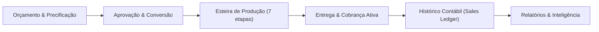
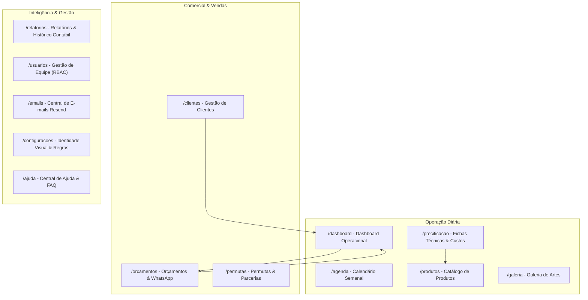
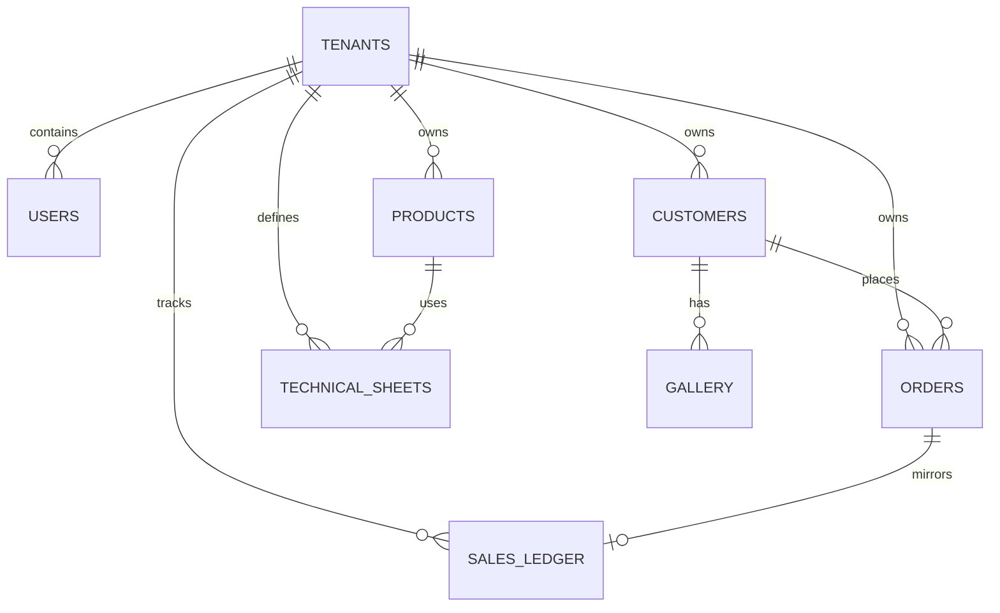
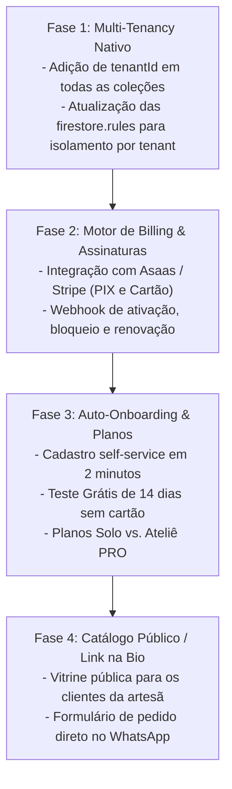

# 📐 Documento de Design e Arquitetura do Sistema — Luisices

> **Versão:** 2.4.0 (Atualizado para SaaS-Ready & Workflow Multi-Tenant)  
> **Status:** Ativo / Em Produção  
> **Público-alvo do Documento:** Engenharia de Software, Designers de Produto, Arquitetos de Solução e Agentes de IA (Stitch / Google Cloud).

---

## 1. Visão Geral do Produto

O **Luisices** é uma plataforma de gestão e automação operacional projetada especificamente para o ecossistema de **papelaria personalizada, cartonagem, sublimação, festas e ateliês criativos sob encomenda**.

Diferente de ERPs tradicionais de caixas fechadas ou ferramentas genéricas de quadros (como Trello), o Luisices resolve o ciclo de vida completo de produtos sob medida: desde a **precificação fracionada de insumos** e aprovação de artes com o cliente até as **7 etapas de produção física**, controle de prazos críticos de eventos e **histórico financeiro contábil independente**.



---

## 2. Pilares Arquiteturais e Stack Tecnológica

### 2.1 Stack Frontend
* **Core:** React 18 com TypeScript e Vite.
* **Roteamento:** React Router v7 com carregador resiliente dinâmico (`lazyWithRetry`) e recuperação automática de cache de chunks.
* **Estilização & Design System:** Tailwind CSS, Radix UI Primitives (estilo shadcn/ui), animações com transições CSS suaves.
* **Linguagem Visual:** *Glassmorphism* (superfícies translúcidas com `backdrop-blur`, bordas suaves com `border-border/60`, paleta adaptativa claro/escuro e 6 paletas de acento personalizáveis).
* **Gráficos & Visualização:** Recharts (AreaChart, PieChart, BarChart) adaptados com tooltips personalizados.
* **Ícones:** Lucide React.
* **Notificações:** Sonner (toasts modernos com suporte a ações e dismiss).
* **Validação:** Zod com schemas tipados para formulários de clientes, pedidos, insumos e usuários.

### 2.2 Stack Backend & Cloud (Serverless)
* **Autenticação:** Firebase Authentication (e-mail/senha, recuperação segura e convites validados por hash).
* **Banco de Dados:** Cloud Firestore (NoSQL em tempo real com `IndexedDB persistence` para cache offline gratuito no navegador).
* **Armazenamento de Arquivos:** Firebase Storage (anexos de pedidos e fotos da galeria em alta resolução).
* **Serverless Functions:** Cloud Functions for Firebase (Node.js 20) com endpoints protegidos (`isAdminRequest`, webhook Resend/Svix criptograficamente verificado).
* **E-mails Transacionais:** Resend API oficial + Webhooks em tempo real com sincronização de cota.
* **Mensageria WhatsApp:** Integração com Evolution API e deep links nativos `https://wa.me/` com templates customizáveis.

---

## 3. Arquitetura da Informação e Módulos do Sistema



---

## 4. Detalhamento dos Módulos Principais

### 4.1 Dashboard Operacional (`/dashboard`)
Projetado para ser a central do **"Aqui e Agora"** do ateliê, sem desviar a atenção para dados contábeis passados distantes:
* **Métricas do Mês Vigente (Dinâmicas):**
  * `Receita (Mês Atual)`: Faturamento consolidado do mês corrente (ex.: *Setembro*), alimentado pelo `salesLedger` para preservar pedidos arquivados, indicando a quantidade de vendas concluídas no mês.
  * `Recebido (Mês Atual)`: Total efetivamente pago no mês vigente.
  * `Ticket Médio (Mês Atual)`: Média do mês, com **descarte automático de pedidos cancelados**.
* **Métricas da Operação Ativa:**
  * `A Receber`: Valor pendente estritamente de pedidos ativos na esteira (quem ainda não pagou).
  * `Total em Aberto`: Valor de pedidos pendentes ou em produção aguardando entrega.
  * `Em Produção` e `Total de Pedidos`.
* **Paginação Inteligente e Densidade:**
  * Seletor de itens por página: `Exibir: [ 6 | 12 | 24 | Todos ]`, com preferência salva no `localStorage`.
  * Paginação independente por aba (*Todos*, *Pendentes*, *Em Produção*, *Concluídos*).
  * Navegação acessível com botões numéricos, reticências, anterior/próxima e rolagem suave para o início da lista.
* **Alertas Operacionais:**
  * Alertas de entregas de hoje e próximos dias (`DeliveryAlerts`).
  * Pedidos atrasados (`OverdueOrders`).
* **Filtros e Ações em Lote:**
  * Busca por cliente, produto, telefone e tags de cor.
  * Filtro de equipe para administradores (`AdminTeamFilter`).
  * Atribuição em lote (`Bulk Assign`) e exclusão em lote com verificação de segurança.

### 4.2 Esteira de Produção de Pedidos (Workflow)
O pedido transita por 7 etapas físicas e digitais:
1. **Design / Arte:** Criação visual do arquivo.
2. **Aprovação:** Validação com o cliente via WhatsApp/PDF.
3. **Impressão:** Envio para impressoras jato de tinta/laser.
4. **Corte:** Plotter de recorte (Silhouette, Cricut, Scanncut) ou corte manual.
5. **Montagem:** Dobradura, colagem, fita banana, laços e ilhós.
6. **Controle de Qualidade:** Verificação visual e conferência de itens.
7. **Embalagem:** Pacote pronto para retirada ou frete.

### 4.3 Módulo de Precificação e Fichas Técnicas (`/precificacao`)
Resolve a maior dor do artesão: **precificar com lucro real**.
* **Cadastro de Insumos:**
  * Tipos: Papéis (por folha ou cm²), Fitas/Aviamentos (por metro), Vinil/Laminados (por cm²), Embalagens e Itens Unitários.
  * Custo de frete rateado e perdas operacionais embutidas (ex: 5% a 15%).
* **Ficha Técnica (BOM - Bill of Materials):**
  * Composição de materiais necessários para 1 unidade.
  * Tempo de mão de obra e custo/hora configurável.
  * Custo de desgaste de equipamento e energia.
  * Margem de lucro desejada e preço de venda sugerido.

### 4.4 Histórico Contábil Independente (`salesLedger`) & Relatórios (`/relatorios`)
* **Independência Operacional vs. Contábil:**
  * A exclusão de clientes ou arquivamento de pedidos da esteira operacional **nunca** apaga o registro financeiro gravado em `salesLedger`.
* **Descarte de Cancelados:**
  * Vendas canceladas são preservadas no ledger com status `cancelled`, mas são automaticamente filtradas e expurgadas dos cálculos de faturamento e ticket médio.
* **Períodos Flexíveis:**
  * Filtros por *Hoje*, *Semana*, *Mês*, *Trimestre*, *Ano*, *Todo o Histórico* e *Personalizado* (intervalo livre De/Até).
* **Inteligência de Negócio:**
  * Gráfico de receita ao longo do tempo.
  * Métodos de pagamento mais utilizados (PIX, Dinheiro, Cartão, Transferência).
  * Rankings de Top Produtos e Top Clientes com maior LTV (*Lifetime Value*).
  * Exportação de dados consolidados em CSV.

### 4.5 Controle de Acesso e Permissões (RBAC Granular)
Matriz de 3 papéis fundamentais:
* **`admin`:** Acesso irrestrito a configurações, dados de toda a empresa, convite e gestão de equipe, delegação de pedidos e relatórios consolidados.
* **`funcionario`:** Focado na execução. Visualiza pedidos atribuídos a ele ou criados por ele, atualiza etapas do workflow, visualiza clientes e produtos conforme permissões delegadas.
* **`user`:** Perfil autônomo padrão. Acessa seus próprios clientes, pedidos e orçamentos, com relatórios individuais estritamente escopados aos seus próprios dados.
* **Revogação em Tempo Real:** Se um administrador suspender um funcionário ou alterar permissões, o listener do Firestore atualiza o `AuthContext` imediatamente, bloqueando rotas sem exigir novo login.

---

## 5. Modelo de Dados (Firestore Collections)



### 5.1 Principais Coleções e Campos

| Coleção | Propósito | Campos Chave |
| :--- | :--- | :--- |
| `users` | Perfis e credenciais RBAC | `uid`, `email`, `displayName`, `role` (`admin`/`funcionario`/`user`), `permissions`, `disabled`, `tenantId` |
| `orders` | Esteira operacional de pedidos | `id`, `orderNumber`, `customerId`, `customerName`, `productName`, `price`, `status`, `workflowStep`, `deliveryDate`, `assignedTo`, `payment`, `tags` |
| `salesLedger` | Histórico contábil imutável | `id` (orderId), `amount`, `paidAmount`, `paymentStatus`, `status`, `date`, `customerId`, `assignedTo`, `tenantId` |
| `customers` | Base de contatos e CRM | `id`, `name`, `phone`, `email`, `address`, `status` (`active`/`defaulter`/`partner`), `totalSpent`, `totalOrders` |
| `quotes` | Orçamentos comerciais | `id`, `quoteNumber`, `customerId`, `items`, `subtotal`, `discount`, `total`, `status` (`draft`/`sent`/`approved`/`rejected`/`expired`) |
| `materials` | Insumos e matérias-primas | `id`, `name`, `category`, `unit`, `costPerUnit`, `wastePercentage`, `supplier` |
| `technicalSheets` | Fichas técnicas e custos | `id`, `productId`, `materials` (lista de insumos e quantidades), `laborMinutes`, `marginPercent`, `suggestedPrice` |
| `gallery` | Acervo de artes e fotos | `id`, `customerId`, `orderId`, `imageUrl`, `thumbnailUrl`, `tags`, `createdAt` |
| `settings` | Preferências e branding | `id` (userId/tenantId), `businessName`, `logoUrl`, `accentColor`, `dashboardCards`, `defaultReportPeriod` |

---

## 6. Diretrizes de UI/UX e Design System

### 6.1 Fundamentos Visuais e Linguagem Glassmorphism
O Luisices utiliza uma identidade visual baseada em **Glassmorphism**, com superfícies translúcidas, desfoque de fundo (`backdrop-blur`), bordas sutis com luminosidade interna e profundidade em camadas. O sistema suporta nativamente **Modo Claro**, **Modo Escuro** e sincronização automática com as preferências do **Sistema Operacional**.

---

### 6.2 Tokens de Cores: Modo Claro vs. Modo Escuro (Especificação Completa)

Abaixo estão todos os tokens CSS definidos em `src/styles/theme.css` e aplicados via Tailwind CSS:

| Token CSS | Modo Claro (`:root`) | Modo Escuro (`.dark`) | Uso / Aplicação |
| :--- | :--- | :--- | :--- |
| `--background` | `#fff8f7` (Branco Rosado suave) | `#161214` (Preto Carbono com matiz Rose) | Fundo principal da página |
| `--foreground` | `#221a1a` (Grafite escuro) | `#e8e0e3` (Cinza Claro Pérola) | Texto padrão de alto contraste |
| `--card` | `rgb(255 255 255 / 55%)` | `rgb(31 25 27 / 86%)` | Superfície de cartões, listas e painéis |
| `--card-foreground` | `#221a1a` | `#e8e0e3` | Títulos e textos dentro de cartões |
| `--popover` | `rgb(255 255 255 / 75%)` | `rgb(36 28 31 / 88%)` | Menus suspensos, dropdowns e popovers |
| `--popover-foreground` | `#221a1a` | `#e8e0e3` | Texto em menus e popovers |
| `--primary` | `#613d3e` (Rosewood Escuro) | `#f4b7b9` (Rose Blush Suave / Pastel) | Botões primários, seleções ativas e badges |
| `--primary-foreground` | `#ffffff` (Branco puro) | `#4c2527` (Vinho Profundo contrastante) | Texto dentro de botões primários |
| `--secondary` | `#5d5c76` (Índigo Acinzentado) | `#b9b5d4` (Lavanda Suave) | Ações secundárias e elementos de apoio |
| `--secondary-foreground`| `#ffffff` | `#28253a` (Roxo Escuro contrastante) | Texto em botões secundários |
| `--muted` | `rgb(255 240 240 / 65%)` | `rgb(43 34 37 / 90%)` | Fundos secundários e áreas desativadas |
| `--muted-foreground` | `#504444` (Marrom Neutro) | `#c9c0b8` / `#9b9197` (Cinza Neutro) | Textos auxiliares, legendas e rótulos |
| `--accent` | `#e2dfff` (Lilás Claro) | `#534150` (Ameixa Escuro) | Realces sutis e itens sob hover |
| `--accent-foreground` | `#45445d` | `#d8bfd1` (Orquídea Suave) | Texto de itens em realce |
| `--destructive` | `#ba1a1a` (Vermelho Rubi) | `#e58e8e` (Salmão Rosado Suave) | Ações críticas, alertas e botões de exclusão |
| `--destructive-foreground` | `#ffffff` | `#321114` (Bordô Escuro) | Texto sobre botões destrutivos |
| `--border` | `rgb(255 255 255 / 33%)` | `rgb(235 205 205 / 16%)` | Linhas divisórias e bordas de inputs |
| `--input` | `rgb(255 255 255 / 40%)` | `rgb(18 14 16 / 70%)` | Fundo de campos de texto e caixas de seleção |
| `--ring` | `#e2dfff` | `#d8bfd1` | Anel de foco acessível (focus-visible) |
| `--sidebar` | `rgb(255 248 247 / 64%)` | `rgb(23 19 21 / 90%)` | Fundo da barra lateral / menu de navegação |
| `--sidebar-border` | `rgb(255 255 255 / 30%)` | `rgb(235 205 205 / 16%)` | Borda divisória da sidebar |
| `--glass-border` | `rgb(255 255 255 / 45%)` | `rgb(235 205 205 / 18%)` | Borda com brilho vítreo translúcido |
| `--glass-shadow` | `0 8px 32px rgb(230 180 180 / 15%)` | `0 16px 40px -8px rgb(0 0 0 / 65%)` | Sombra volumétrica de profundidade |
| `--button-glass-bg` | `rgb(123 84 85 / 15%)` | `rgb(211 154 156 / 14%)` | Fundo de botões estilo vidro |
| `--button-glass-text` | `#7b5455` | `#e8c5c8` | Texto de botões estilo vidro |

---

### 6.3 Iluminação de Fundo & Gradientes Atmosféricos

O sistema utiliza iluminação atmosférica radial fixa (`background-attachment: fixed`) sob a interface para criar profundidade e sensação tridimensional:

* **Modo Claro:**
  * Base: `linear-gradient(135deg, #fceee9 0%, #fff8f7 52%, #ede7f6 100%)`
  * Luz Superior Esquerda: `radial-gradient(circle at 8% 8%, rgb(247 214 208 / 80%) 0, transparent 34%)`
  * Luz Central: `radial-gradient(circle at 52% 38%, rgb(209 196 233 / 65%) 0, transparent 38%)`
  * Luz Inferior Direita: `radial-gradient(circle at 92% 82%, rgb(187 222 251 / 60%) 0, transparent 36%)`

* **Modo Escuro (`.dark`):**
  * Base: `#161214` (e fundo do HTML em `#0f0d0e`)
  * Brilho Blush: `radial-gradient(circle at 15% 10%, rgb(91 50 52 / 22%) 0, transparent 45%)`
  * Brilho Lavanda: `radial-gradient(circle at 85% 25%, rgb(40 25 45 / 28%) 0, transparent 50%)`
  * Brilho Azul Noturno: `radial-gradient(circle at 50% 80%, rgb(18 28 32 / 30%) 0, transparent 60%)`

---

### 6.4 Paletas de Cores de Destaque Customizáveis

Além da alternância Claro/Escuro, os usuários podem personalizar a cor primária de destaque do ateliê em **Configurações > Aparência**:

| Chave | Nome | Hex Exibição | CSS Primária | Ring / Foco |
| :--- | :--- | :--- | :--- | :--- |
| `default` | **Padrão (Rosewood)** | `#613d3e` | `#613d3e` | `oklch(0.708 0 0)` |
| `rose` | **Rosa** | `#c9868b` | `#c9868b` | `oklch(0.645 0.246 16.439)` |
| `purple` | **Roxo** | `#8b7eaa` | `#8b7eaa` | `oklch(0.627 0.265 303.9)` |
| `blue` | **Azul** | `#718fa3` | `#718fa3` | `oklch(0.546 0.245 264.052)` |
| `green` | **Verde** | `#759986` | `#759986` | `oklch(0.527 0.154 150.069)` |
| `orange` | **Laranja** | `#b18a63` | `#b18a63` | `oklch(0.646 0.222 41.116)` |
| `custom` | **Personalizado** | *Qualquer Hex* | *Hex livre* | *Mesmo Hex* |

---

### 6.5 Cores Semânticas de Negócio e Status

Estas cores mantêm consistência funcional independente do tema ativo:

* **Status de Pedidos:**
  * Concluído: `#10B981` (Esmeralda)
  * Em andamento / Produção: `#3B82F6` (Azul)
  * Pendente / Aguardando início: `#F59E0B` (Âmbar)
  * Cancelado: `#EF4444` (Vermelho)
* **Status Financeiro:**
  * Pago: `#10B981` (Verde)
  * Parcial / Sinal recebido: `#3B82F6` (Azul)
  * Pendente / A receber: `#F59E0B` (Laranja)
* **Métodos de Pagamento:**
  * PIX: `#6366F1` (Índigo)
  * Dinheiro: `#10B981` (Esmeralda)
  * Cartão de Crédito: `#F59E0B` (Âmbar)
  * Cartão de Débito: `#EF4444` (Vermelho)
  * Transferência bancária: `#8B5CF6` (Roxo)

---

### 6.6 Tipografia e Responsividade Mobile
* **Tipografia:** Família Sans moderna (`var(--font-family-sans)` / Inter / Geist) com escala tipográfica legível e suporte a números tabulares (`tabular-nums`) para evitar oscilações em contadores monetários e tabelas.
* **Layouts Fluidos e Mobile-First:**
  * Todos os diálogos e modais ocupam `calc(100vw - 1.5rem)` em smartphones com `max-h-[90dvh]` e rolagem interna.
  * Interceptação nativa do botão "Voltar" do celular (`popstate` listener via `useModalHistory`) para fechar modais antes de sair da página.

---

### 6.7 Padrão Oficial do Design System para Diálogos e Modais (Mobile-First & Web)

Para garantir paridade entre a experiência no celular e no computador, e evitar bugs visuais de rolagem e corte de conteúdo, todo novo modal deve seguir obrigatoriamente as seguintes convenções:

#### 1. Tabela de Tamanhos Declarativos (`size` prop no `DialogContent`):
Evite strings CSS manuais como `w-[calc(100vw-1.5rem)] sm:max-w-2xl`. Utilize a propriedade tipada `size`:

| Tamanho | Classe Aplicada | Largura Desktop | Caso de Uso Recomendado |
| :--- | :--- | :--- | :--- |
| `sm` | `sm:max-w-sm` | 384px | Confirmações rápidas, mini-uploads de foto, inputs únicos |
| `md` | `sm:max-w-md` | 448px | Formulários simples (Pastas, Insumos avulsos, Edição rápida) |
| `lg` | `sm:max-w-lg` | 512px | *(Padrão default)* Cadastros normais (Clientes, Nova Arte) |
| `xl` | `sm:max-w-xl` | 576px | Formulários intermediários com mais colunas |
| `2xl` | `sm:max-w-2xl` | 672px | Novo Pedido, Detalhes de Pedido, Orçamentos, Seletor de Galeria |
| `3xl` | `sm:max-w-3xl` | 768px | Fichas técnicas, simuladores de lote, lightbox médio |
| `4xl` | `sm:max-w-4xl` | 896px | Lightbox da Galeria com IA Multimodal e painel lateral |
| `full` | `sm:max-w-[calc(100vw-2rem)]` | Quase tela cheia | Visualizadores imersivos ou relatórios extensos |

#### 2. Anatomia Padrão do Modal (Header -> Body -> Footer):
```tsx
<Dialog open={open} onOpenChange={onOpenChange}>
  <DialogContent size="lg" className="max-h-[90dvh] flex flex-col p-0 overflow-hidden">
    {/* Cabeçalho fixo no topo */}
    <DialogHeader className="px-4 sm:px-6 pt-4 sm:pt-6 pb-2 border-b">
      <DialogTitle>Título do Modal</DialogTitle>
      <DialogDescription>Subtítulo ou instrução opcional</DialogDescription>
    </DialogHeader>

    {/* Corpo com rolagem interna suave */}
    <DialogBody className="px-4 sm:px-6 py-4 space-y-4">
      {/* Campos de formulário aqui */}
    </DialogBody>

    {/* Rodapé fixo na base (botões sempre visíveis) */}
    <DialogFooter className="px-4 sm:px-6 py-3 border-t bg-card/60">
      <Button variant="outline" onClick={onClose}>Cancelar</Button>
      <Button onClick={onSave}>Salvar</Button>
    </DialogFooter>
  </DialogContent>
</Dialog>
```

#### 3. Regras Mandatórias de UX Mobile:
1. **Nunca usar `fixed inset-0` manuais com `div`:** Sempre use o `Dialog` do Design System (`src/app/components/ui/dialog.tsx`). Isso garante foco acessível, leitor de tela e suporte ao botão "Voltar" físico/gestual do celular.
2. **Nunca usar `min-h-[70dvh]` ou alturas mínimas artificiais:** Em celulares, quando o teclado virtual abre, alturas mínimas causam transbordamento e impedem a visualização dos campos.
3. **Uso de `dvh` em vez de `vh`:** Telas móveis possuem barras dinâmicas do navegador (Safari iOS e Chrome Android). Sempre use `max-h-[90dvh]` ou `h-[100dvh]`.
4. **Touch targets mínimos:** Todos os botões clicáveis com os dedos devem ter no mínimo `size-8` a `size-10` (36px a 44px) com margens confortáveis.
5. **Hierarquia de Z-Index Estrita:**
   - Telas e layouts normais: `z-0` a `z-30`
   - Barra de navegação inferior mobile (`Layout.tsx`): `z-40`
   - Overlays, Diálogos e Sheets (`DialogContent`, `SheetContent`): `z-50`
   - Toasts e notificações Sonner: `z-[100]`

## 7. Roadmap de Evolução para SaaS Multi-Tenant

Para produtizar a solução comercialmente, o sistema está desenhado para suportar os seguintes passos:



### 7.1 Blindagem de Infraestrutura & Custos
* **Leituras no Firestore:** Protegidas por paginação obrigatória, queries limitadas e cache IndexedDB ativado.
* **Armazenamento:** Compressão automática de imagens no navegador antes do upload para garantir fotos de ~200 KB.
* **Custo por Tenant:** Projetado para custar menos de **R$ 0,50/mês por cliente**, garantindo margem bruta superior a **95%** em planos a partir de R$ 39/mês.

---

*Documento mantido pela equipe de desenvolvimento e arquitetura do Luisices.*
